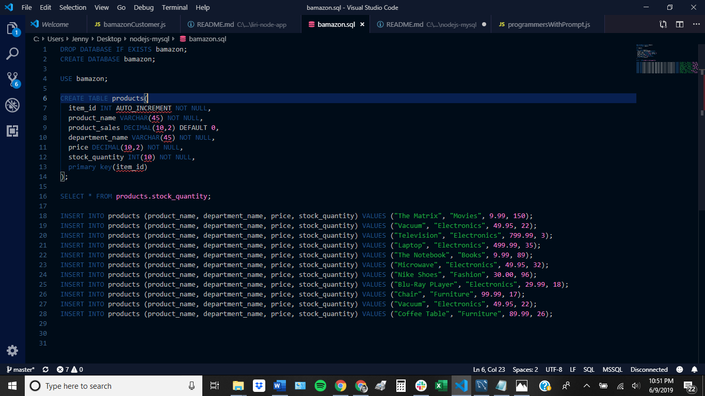
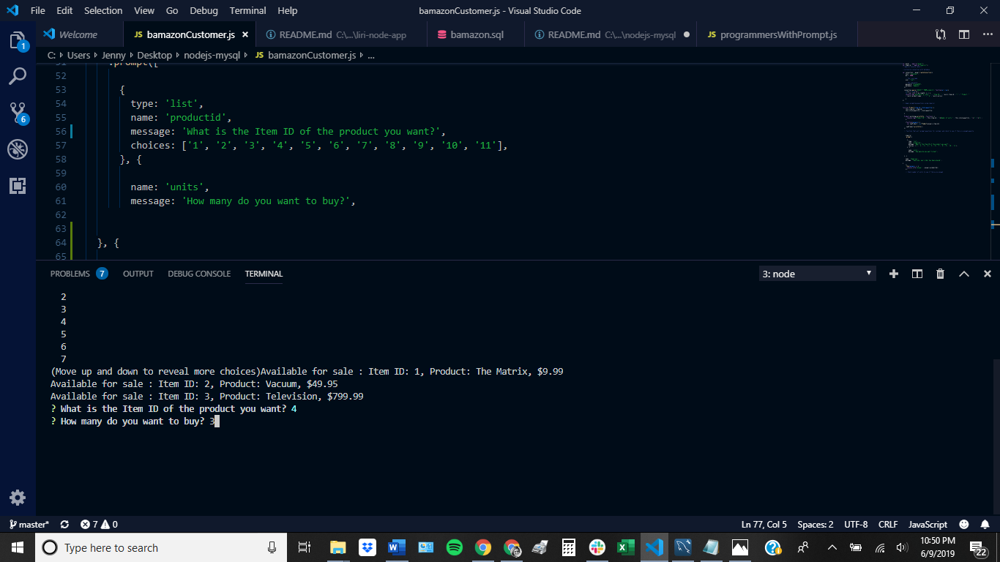
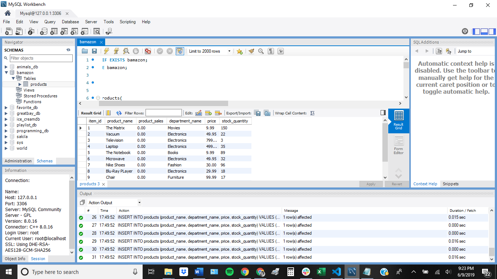

Bamazon!

###### About this app:

Users are presented with a list of items for sale and their price. Using their arrow key, they can select the item's ID number. Then they'll be asked how many they want to buy. If there is enough quantity of inventory, their purchase will be completed.

This app was created using Node.js, MySQL, and the Inquirer NPM package. See screenshots below:

